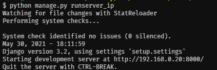
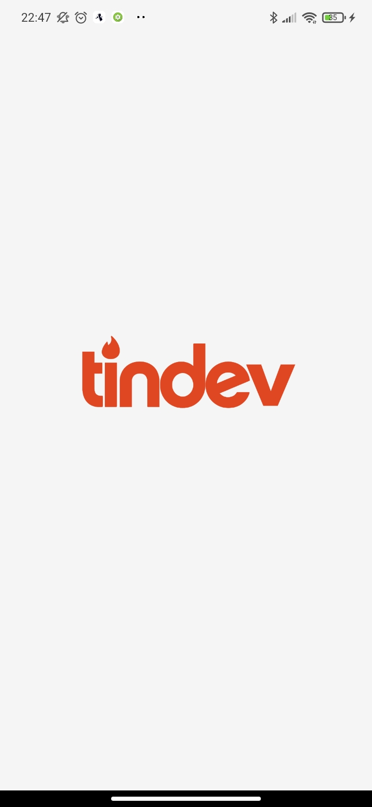
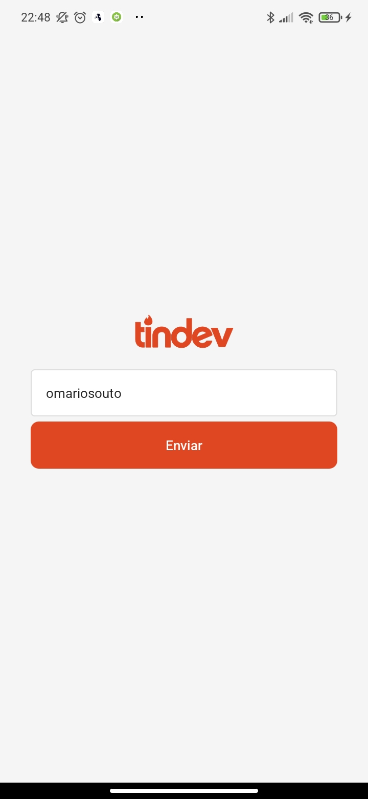
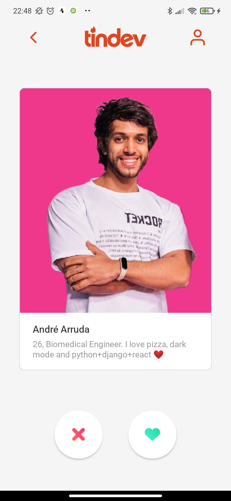
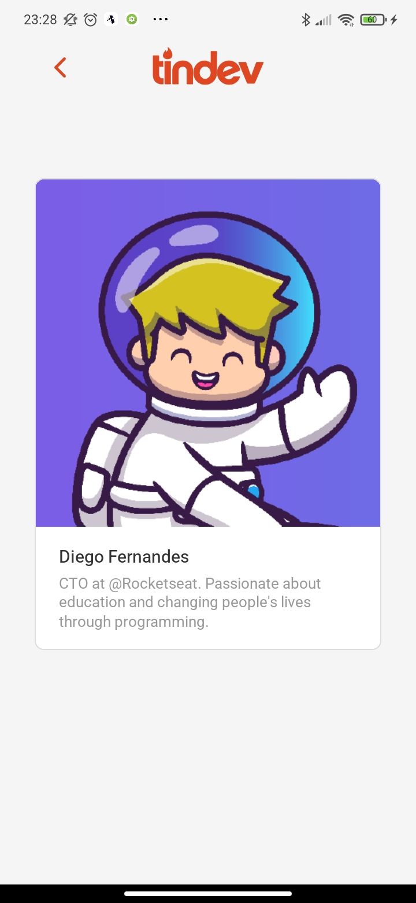
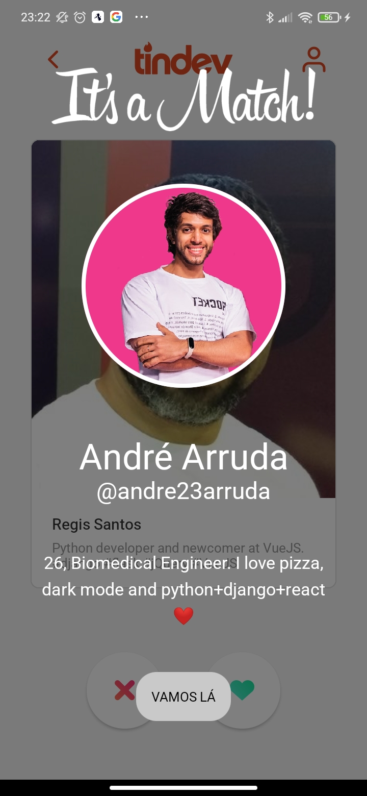

<h1 align="center">
    
</h1>

<h2 align="center">
  🚀 Semana omnistack 8
</h2>


<p align="center">
  <a href="#-tecnologias">Tecnologias</a>&nbsp;&nbsp;&nbsp;|&nbsp;&nbsp;&nbsp;
  <a href="#-projeto">Projeto</a>&nbsp;&nbsp;&nbsp;|&nbsp;&nbsp;&nbsp;
  <a href="#instalação">Instalação</a>
</p>

## 🚀 Tecnologias

Esse projeto foi desenvolvido com as seguintes tecnologias:

- [Django](https://www.djangoproject.com/)
- [Django-Rest-Framework](https://www.django-rest-framework.org/)
- [Django Channels](https://channels.readthedocs.io/en/stable/)
- [React](https://reactjs.org)
- [React Native](https://facebook.github.io/react-native/)
- [Expo](https://expo.io/)

## 💻 Projeto
**Tindev é uma aplicação para Devs darem Match**

## Instalação
### Pré requisitos
Ter instalado:
- [Python](https://www.python.org/downloads/)
- [Node](https://nodejs.org/en/download/)
- [Yarn](https://classic.yarnpkg.com/en/docs/install/)

### Backend
#### Primeiro: modificar variáveis de ambiente (se houver)
-  **_backend/setup/env_example.py_**

#### No terminal, rodar
```sh
# Entrar na pasta dos arquivos do backend
cd backend

# Renomear env_example.py para env.py
cp setup/env_example.py setup/env.py

# Criar um ambiente virtual
python -m venv venv

# Ativar o ambiente virtual
. venv/Scripts/activate
# ou ./venv/bin/activate

# Instalar os pacotes necessários
pip install -r requirements.txt

# Executar as migrações
python manage.py migrate

# Rodar backend
python runserver.py
```
<p align="center">
    
</p>

### Frontend
#### No terminal, rodar
```sh
# Entrar na pasta dos arquivos do frontend
cd web

# Instalar os pacotes necessários
yarn install

# Rodar
yarn start
```
#### Páginas
<div align="center">
    
</div>
<p align="center">Login Page</p>
<hr>

<div align="center">
    
</div>
<p align="center">Devs Page</p>
<hr>

<div align="center">
    
</div>
<p align="center">User Page</p>
<hr>

<div align="center">
    
</div>
<p align="center">Match</p>
<hr>

### Mobile
#### No terminal, rodar
```sh
# Entrar na pasta dos arquivos do projeto mobile
cd mobile

# Instalar os pacotes necessários
yarn install

# Rodar
expo start
```

#### Rodar expo no celular
- Abrir expo no celular
- Ler QR code e executar o app

#### Telas
<div align="center">
    
    
</div>
<p align="center">Splash Screen and Login</p>
<hr>


<div align="center">
    
    
</div>
<p align="center">Devs and User</p>
<hr>

<div align="center">
    
</div>
<p align="center">Match</p>
<hr>
